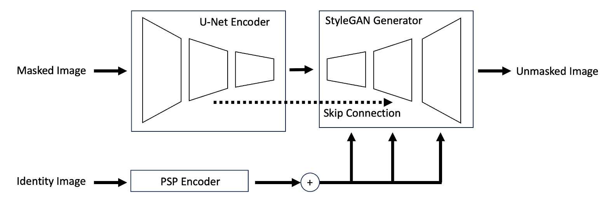

# UnVeilify
## A Path Towards Personalized Face Mask Removal

We aim to remove facial masks from images using a novel neural network architecture. Facial
masks have been, and will be part of many people's lives. *UnVeilify* can remove these face masks
from any image, given a masked image and an identity image, while preserving the identity features.
<p align='center'>

</p>

Documentation of our project can be seen in our [documentation](/docs/main.pdf).

## Usage

### Training
Update the options file and run the following command.
```bash
python train.py -c options/UnVeilify.yaml
```
The pretrained model required for training can be found in [eladrich/pixel2style2pixel](https://github.com/eladrich/pixel2style2pixel),
where we use the pretrained IR-SE50 model.

### Inference
Change the directory to the model checkpoint and dataset, then run the following command.
```bash
python test.py -c CHECKPOINT_DIR -d DATASET_DIR
```


## References

[Pixel2Style2Pixel Encoder Implementation](https://github.com/eladrich/pixel2style2pixel)

[StyleGAN2 Implementation](https://github.com/labmlai/annotated_deep_learning_paper_implementations/tree/master/labml_nn/gan/stylegan)


